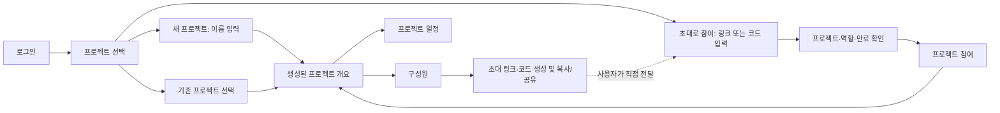

# 프로젝트 중심 화면과 참여 흐름 전면 재설계

## Request and specialist handoff

- 작업일: 2026-09-07. 로컬 원본: `docs/ux/2026-09-07-project-management-redesign-plan.md`.
- 실제 위임: 상위 조정자 `/root` → UI 전문 에이전트 `/root/project_redesign_designer`, 역할 `ai-erp-ui-ux-designer`. 전문 에이전트는 소스 조사와 이 기획 문서만 작성하며 앱·테스트·설정 코드를 작성하지 않는다. 구현 판정은 상위 조정자, 독립 `ui-plan-review` 판정은 별도 reviewer가 담당한다.
- 사용자 요구: 로그인 후 첫 단계는 프로젝트 선택이다. 새 프로젝트를 만든 다음 해당 프로젝트 안에서 사람을 초대한다. 실제 코드/링크 복사와 공유를 제공하며, 의미를 알기 어려운 관리자 요청문 복사를 없앤다. 프로젝트 선택 전 Calendar 노출과 현재 화면 전반의 구성도 재설계한다.
- 대상 사용자: 처음 가입한 생성자, 기존 프로젝트 참여자, 초대를 받은 사람, 프로젝트 관리자와 조회자. 첫 사용자는 선행 그룹·관리자·초대 없이 프로젝트를 만들어 시작할 수 있어야 한다.
- 범위: 로그인/로비/생성/참여, 프로젝트 공통 탐색, 개요/일정 목록·상세·편집, 구성원/초대, 알림/계정 연동의 정보 계층과 시각 체계. 기능 변경의 핵심은 직접 생성과 초대·구성원 관리다. 일정 도메인의 확인·확정·취소·시간대 규칙, Google OAuth 제공자, 운영 데이터 일괄 정리, 그룹 관리 제품, 프로젝트 삭제/탈퇴는 이번 범위 밖이다.
- 이 계획은 PR #8의 생성 권한 안내와 평면 메뉴 유지 결정을 대체한다. 이전 계획의 검증 PASS가 이번 사용성 판단을 대신하지 않는다.
- 이번 변경 기준 커밋은 `1e2435b`다. 아래 D1~D8은 사용자 선택과 상위 조정자의 최종 판정을 반영하며 구현자가 재선택할 미결정은 없다.

## Current evidence and constraints

| 조사한 로컬 소스 | 발견과 설계 영향 |
| --- | --- |
| `frontend/src/ui.tsx`의 `Shell` | 프로젝트 선택·알림·Calendar와 프로젝트 메뉴가 동일한 줄에 섞인다. 로비와 프로젝트 안의 탐색을 분리해야 한다. |
| `frontend/src/screens/Account.tsx`의 `Projects`, `InviteCreate`, `Members` | 로비에 여러 작업 폼이 모두 펼쳐지고, 초대 성공은 링크 필드와 초대 열기만 제공한다. 구성원은 UUID로 표시된다. 작업을 선택한 뒤 해당 폼으로 들어가고, 초대는 관리자 문맥에 배치해야 한다. |
| `frontend/src/screens/ProjectStart.tsx` | `AdministratorRequest`가 실제 참여 수단처럼 노출된다. 생성 전에 기존 그룹을 요구해 신규 사용자의 정상 시작이 불가능하다. 요청문 기능은 제거하고 직접 생성 API가 필요하다. |
| `backend/.../project/api/ProjectController.java`, `group/api/GroupAccess.java` | 기존 생성은 `groupId`와 기존 OWNER/ADMIN이 필요하다. 직접 생성은 새 내부 그룹·OWNER·프로젝트·MANAGER를 한 트랜잭션에 만들고 기존 그룹의 권한을 올리지 않는 별도 경로로 설계한다. |
| `backend/.../project/InvitationService.java`, `InvitationController.java` | 현재 초대는 검증된 특정 이메일만 사용 가능한 7일·1회 수락 토큰이다. 재사용 코드 기능이 아니다. 생성은 그룹 멤버십도 요구하지만 수락은 프로젝트 멤버십만 추가하므로, 초대받은 MANAGER의 초대 권한도 일관되게 고쳐야 한다. |
| `CurrentUserController.java`, `UserAccountEntity.java` | `/me`는 UUID만 제공하지만 저장된 계정에는 displayName/email이 있다. 본인 정보와 권한 있는 프로젝트 구성원 표시에 필요한 최소 표시 정보를 읽기 API로 보강한다. |
| `frontend/src/screens/Schedules.tsx`, `Detail.tsx`, `ScheduleForm.tsx`, `app.css` | 전반적으로 기본 태그와 동일 색상의 버튼을 나열하고 원시 상태·revision·투영 정보를 전면 표시한다. 공통 표면/도구모음/상태 배지/읽기 계층을 모든 화면에 적용한다. |

- 스택은 기존 React 19/TypeScript/Vite/TanStack Query를 유지한다. 해시 라우트와 직접 링크 호환성을 보존한다. 프로젝트별 권한과 그룹 권한을 혼동하지 않으며 서버가 최종 권한을 판단한다.
- 직접 생성마다 별도 내부 그룹을 만든다. 사용자별 home-group 재사용·이동·소유권 변경 규칙을 이번에 추가할 이유가 없고, 프로젝트 사이의 관리 범위를 분명히 나눌 수 있다. 그룹은 인프라 경계이며 신규 사용자에게 입력 항목으로 요구하지 않는다. 기존 권한 있는 그룹에 생성하는 API는 호환 유지한다.
- 선택 지침: `ai-erp-frontend-design`은 장식보다 업무 계층과 명확한 동사를 적용한다. `ai-erp-ui-ux-pro-max`의 `project management internal workspace --design-system` 결과는 마케팅 funnel과 부적합한 영문 서체여서 채택하지 않았다. 한 번 좁힌 `enterprise project workspace --design-system`도 Hero 패턴은 부적합하므로 배제하고 기능 중심 배열·절제한 표면만 참고했다. `keyboard focus dialog --domain ux`의 가시적 포커스/가림 방지 결과를 모달에 적용한다. `ai-erp-web-design-guidelines`의 고정 로컬 snapshot을 기준으로 폼·의미·피드백·반응형을 검토한다. 외부 가이드를 갱신하지 않았다.

## Workflow and screen structure

### 대안 비교와 권고

| 대안 | 시작과 초대 방식 | 이점 | 한계와 판정 |
| --- | --- | --- | --- |
| A. 이메일 지정 초대 개선 | 직접 생성 → 구성원 → 대상 이메일 → 그 사람 전용 링크/토큰 복사 | 현 계약 변화가 작고 수신 대상을 제한한다. | 누구나 쓰는 코드로 설명하면 오해가 남는다. 팀 단위 간단한 공유에는 매번 이메일 입력이 필요하다. 사용자 선택 시 적용 가능한 대안이다. |
| B. 프로젝트 공유 초대 | 직접 생성 → 구성원 → 공유 링크/코드 생성 → 여러 사람이 로그인 후 참여 | 사용자가 기대한 프로젝트 안의 초대·코드 복사·공유 흐름에 가장 가깝다. | 만료·철회·동시 수락·중복 멤버 방지를 새로 구현한다. UI 전문 권고 후 사용자가 선택했다. 이메일 초대와 별개 계약이며 별도 시도 제한 계층은 이번에 추가하지 않는다. |
| C. 범용 단일 사용 초대 | 직접 생성 → 사람 수만큼 1회용 링크/코드 생성 | 이메일을 모르더라도 참여 가능하고 사용 수를 제한한다. | 단체 대화방에서 먼저 누른 사람만 성공하며 나머지에게 오해가 생긴다. 일상 팀 참여 기본값으로 권고하지 않는다. |

**확정: 사용자 응답은 ‘공유 코드·링크: 받은 사람이 로그인 후 참여’다.** 상위 조정자가 2026-09-07 응답을 전달하여 B를 확정했다. 새 기본 UI는 재사용 공유 초대이며 기존 A 링크는 이메일 귀속 수락 호환만 유지한다. 이 명시 요청은 과거 이메일 전용 화면 정책을 대체한다.



### 탐색 깊이와 공통 프레임

- 첫 depth `#/`: 제목 `프로젝트 선택`, 내 프로젝트 목록, `새 프로젝트`, `초대로 참여`. 로그인할 때 임의의 최근 프로젝트나 Calendar로 자동 진입하지 않는다. 유효한 초대/프로젝트 직접 링크만 해당 목적지로 복귀한다. 로비에는 프로젝트 업무 메뉴와 Calendar 항목이 없다.
- 두 번째 depth `#/projects/:id`: 선택 프로젝트 이름이 분명한 공통 프레임. 왼쪽에는 `프로젝트 선택으로`와 프로젝트 이름, `개요`, `일정`, `구성원`의 세 항목을 둔다. 상단 오른쪽에는 알림과 계정 메뉴를 보조 기능으로 둔다. 현재 메뉴는 `aria-current="page"`로 표시한다. 프로젝트 이름과 메뉴는 실제 선택한 프로젝트에서만 표시한다.
- 세 번째 depth: 일정 상세·만들기·수정, 구성원 초대 다이얼로그. 기존 `#/projects/:id/invitations/new` 직접 링크는 구성원 화면 위에 같은 초대 다이얼로그를 열며 뒤로 가기로 구성원에 돌아온다. 취소·닫기 버튼은 방금 사용한 호출 컨트롤로 포커스를 돌린다.
- 계정 메뉴의 `계정 설정`에 `Google Calendar 연결`을 배치한다. 프로젝트 일정과 별개의 개인 계정 연동임을 `이 연결은 내 계정의 모든 프로젝트에 적용됩니다.`로 밝힌다. 로비 계정 메뉴에는 본인 표시와 로그아웃/계정 전환만 둔다. 과거 `#/calendar` 직접 링크는 기능을 유지하는 계정 설정 화면으로 정규화하며 프로젝트 선택 전 기본 메뉴로 다시 노출하지 않는다.
- 알림은 계정 공통 보조 화면이다. `전체 프로젝트 알림` 문구와 출발 프로젝트로 돌아갈 수 있는 경로를 제공한다. 특정 프로젝트 알림 링크는 해당 프로젝트의 접근 확인 후 이동한다. 로비에서는 알림 목록보다 프로젝트 선택이 시각적·키보드 순서의 우선 작업이다.

### 로비와 직접 생성

```text
AI ERP                                                     [이름 ▾]

프로젝트 선택                           [초대로 참여] [＋ 새 프로젝트]
함께 진행할 프로젝트를 선택하세요.
─────────────────────────────────────────────────────────────────
프로젝트 이름                                      내 역할       열기
운영 정비                                         관리자          ›
고객 포털 개선                                    구성원          ›
─────────────────────────────────────────────────────────────────
                                            [이전]  1페이지  [다음]

0개일 때 목록 자리:
  첫 프로젝트를 만들어 시작하세요
  프로젝트 안에서 구성원을 초대하고 일정을 관리할 수 있습니다.
  [새 프로젝트 만들기]  [초대로 참여]

새 프로젝트 다이얼로그:
  새 프로젝트                                      [닫기]
  프로젝트 이름
  [예: 고객 포털 개선…                                 ]
  이 프로젝트의 관리자로 시작합니다.
                                 [취소] [프로젝트 만들기]
```

- 로비는 목록을 중심으로 구성한다. 역할은 `관리자/구성원/조회자`로 번역한다. UUID·생성 권한 이유·그룹 페이지·요청문·계정 종료 설명을 본문에 펼치지 않는다. 실제 읽기 API에 없는 활동일/구성원 수/프로젝트 색상은 만들어 표시하지 않는다.
- 기본 목록은 서버의 안정적인 페이지 순서대로 보여준다. 전체 검색/정렬 API가 없으므로 현재 페이지만 검색하면서 전체 검색처럼 표시하지 않는다. 이번에는 검색·필터·대량 선택·즐겨찾기를 넣지 않는다. 100개 단위 페이지와 명확한 이전/다음, 빈 다음 페이지에서 이전 돌아가기를 유지한다.
- `새 프로젝트`는 이름 1~200자(양끝 공백 제거), 입력 검증, 실제 생성 한 번으로 끝난다. 기존 소속과 무관한 독립 프로젝트 생성이며 그룹 선택 UI는 제공하지 않는다. 기존 `groupId` 생성 API의 서버 호환만 유지한다.
- 생성 성공은 응답의 실제 ID로 `개요`를 열고 `프로젝트를 만들었습니다.`를 알린다. 생성 직후 빈 개요의 첫 행동은 `구성원 초대`, 두 번째는 `일정 만들기`다. 초대를 반드시 완료해야 나갈 수 있는 마법사는 만들지 않는다.
- 생성 요청은 UUID `requestId`를 포함한다. 서버는 동일 사용자+requestId에 트랜잭션 advisory lock을 잡고 정규화된 이름과 요청 groupId가 같으면 같은 프로젝트를 반환한다. 동일 키의 다른 payload는 409다. 응답이 유실되어도 같은 키 재전송이 추가 그룹/프로젝트를 만들지 않는다. 기존 `GoogleIdentityRepository` 잠금 패턴을 따른다. UI는 입력을 바꾸지 않은 재시도에는 같은 키를 보존하고, 입력 변경 또는 새 명시적 생성 시도에만 새 키를 만든다. POST 자동 재시도는 없다. 결과 불확실 안내의 `생성 결과 다시 확인`은 같은 payload/키로 사용자가 직접 실행한다.

### 프로젝트 내부와 전체 화면 시각 리팩토링

```text
AI ERP                운영 정비                       [알림] [이름 ▾]
───────────────────────────────────────────────────────────────────
프로젝트 선택으로     │ 개요                      [구성원 초대]
운영 정비            │ 다음 2주 일정
                     │  9/08  운영 회의           확정
● 개요               │  9/10  배포 점검           초안
  일정               │──────────────────────────────────────────────
  구성원             │ 확인이 필요한 일정  2     [일정 보기]
                     │ 일정 8   확인 대기 2   연결 확인 필요 1
```

- 프로젝트 업무가 화면의 중심이다. 개요는 다가오는 일정과 처리 대기를 먼저 배치하고 수치는 보조 요약으로 둔다. 신규 프로젝트에서는 가짜 지표 대신 `구성원을 초대하고 첫 일정을 만들어 보세요.`와 실제 행동을 제공한다.
- 공통 토큰 권고: 배경 `#F6F8FB`, 표면 `#FFFFFF`, 본문 `#172033`, 보조 글자 `#52647F`, 주 행동 `#1E5AA8`, 경계 `#D9E0EA`. 오류 `#B42318`, 포커스 `#9A5B00`는 기능 상태 토큰이다. 기존 파란 계열의 연속성을 지키고 새로운 장식 테마를 들이지 않는다. 실제 조합의 대비는 구현 단계에서 측정한다.
- 서체는 한글 가독성과 추가 외부 요청 방지를 위해 `"Malgun Gothic", "Apple SD Gothic Neo", system-ui, sans-serif`를 사용한다. 본문 16px/1.55, 보조 14px 이상, 화면 제목 28px/1.3, 절 제목 18~20px. 링크·본문은 왼쪽 정렬, 표의 수치는 tabular-nums. 데스크톱 본문 최대 1200px, 사이드 영역 약 224px, 8px 간격 단위와 24~32px 섹션 간격을 사용한다.
- 주 행동은 화면당 1개를 강조하고, 보조는 외곽선/텍스트 버튼으로 구분한다. 모든 폼/섹션을 같은 둥근 카드로 감싸지 않는다. 로비는 넓은 목록, 다이얼로그는 집중된 입력, 프로젝트 화면은 작업 영역과 얇은 구분선으로 구별한다. 동작 피드백 이외 자동 애니메이션·gradient·hero 이미지가 필요하지 않다.
- 일정: 헤더의 `일정 만들기`와 월간/주간 전환을 분리하고, 검색·상태·기간 등 상세 필터는 펼칠 수 있는 한 영역에 묶는다. 기본 일정 도메인과 범위 필터의 의미는 유지한다. 좁은 화면에서는 읽을 수 없는 7열 주간 시간표 대신 동일 데이터의 날짜별 목록을 기본 제공하고 월간/주간 선택은 보존한다. 달력 외에 키보드로 읽고 여는 일정 목록을 항상 제공한다.
- 상세: 제목/날짜/상태와 가능한 업무 행동을 먼저, 참석자 확인·변경 이력을 다음으로 둔다. 원시 `businessRevision`, `rowVersion`, `retryClassification`, `traceId`는 주요 본문에서 제거하고 오류 진단이 필요한 경우에만 접힌 `오류 상세`에 둔다. 일정 상태는 `초안/확정/취소`, Calendar 투영은 사용자에게 필요한 `연결 필요/동기화 중/동기화 완료/동기화 실패` 등으로 번역한다.
- 일정 폼: `기본 정보 → 날짜와 시간 → 참석자` 순서, 저장/취소는 마지막에 일관된 위치, 오류는 해당 필드 옆에 표시한다. 멤버 UUID 대신 서버가 제공한 표시 이름을 사용하고 원래 참석자와 동시 수정/권한 회복 규칙을 유지한다.
- 알림: 읽음 여부·사용자에게 의미 있는 알림명·발생 시각·프로젝트 이동을 행으로 구성한다. 원시 이벤트 enum과 시스템 지표를 화면 문구로 쓰지 않는다. 계정 설정은 본인 정보와 연결 상태를 분리하고 `연결 상태 새로고침`이 실제 OAuth 재인증을 수행하지 않으면 `다시 연결`이라고 부르지 않는다.

### 구성원과 초대: 확정안 B

- `구성원` 화면은 이름, 이메일, 역할을 보여주며 본인은 `나`로 식별한다. 조회자는 읽기만 가능하고 관리자에게만 우상단 `구성원 초대`를 제공한다. 프로젝트 멤버 이름을 읽을 권한 없는 사람에게 정보를 노출하지 않는다.
- 역할은 `관리자 / 구성원 / 조회자`. 관리자가 값을 고르면 즉시 저장하지 않고 해당 행의 `저장/취소`로 확정한다. 마지막 관리자를 낮추는 변경은 서버에서 차단하고 `프로젝트에 관리자가 최소 한 명 필요합니다.`를 표시한다. 권한 상실 시 실제 역할을 새로 조회하고 쓰기 컨트롤을 제거한다.
- 공유 초대는 프로젝트마다 현재 활성 초대 1개로 시작한다. 관리자 다이얼로그는 처음에 `초대 만들기`, 생성 후에는 아래 정보와 행동을 제공한다. 기존 활성 초대를 다시 열 때 새 토큰을 자동 발행하지 않는다. `새 초대로 바꾸기`는 기존 공유 초대가 즉시 사용 불가능해짐을 확인받은 뒤 교체한다. 별도 `초대 사용 중지`도 확인 후 철회한다. 발행 POST는 명시적인 새 코드 발행/교체이므로 응답 유실 때 재전송하면 안 된다. UI는 변경 버튼을 잠그고 `초대 상태 다시 확인`으로 현재 초대를 GET한 뒤 실제 코드와 상태를 복구한다. GET이 실패하면 잠금과 조회 재시도를 유지하며 새 발행 POST를 자동 재시도하지 않는다.

```text
운영 정비에 구성원 초대                              [닫기]
링크 또는 코드를 받은 사람은 로그인 후 구성원으로 참여합니다.

초대 링크  [https://…/#/join/…                ] [링크 복사]
초대 코드  [7K3M-9F2D-6R8T-WX4C               ] [코드 복사]
                                                [공유]
구성원으로 참여 · 만료 2026. 9. 14. 18:30
                           [초대 사용 중지] [새 초대로 바꾸기]
```

- 코드와 링크는 **같은 초대 권한**을 표현한다. 상위 확정은 보안 난수로 생성한 Crockford 대문자 16자(80bit), 4자씩 구분 표시다. 입력은 대소문자·하이픈·ASCII 공백을 정규화하되 허용 알파벳/길이와 파싱 입력 크기를 엄격하게 제한한다. 6자리 숫자 등 낮은 entropy 코드로 줄이지 않는다. 인증과 검증된 계정, 고엔트로피 코드, 비유효 응답의 정보 비공개를 적용한다. 별도 무차별 대입 탐지/시도 제한 계층은 이번 범위에서 제외하며 이미 구현된 기능처럼 표시하거나 주장하지 않는다. 예시 코드는 wireframe이며 실제 데이터로 쓰지 않는다. 새 링크는 `#/join/:code`, 기존 이메일 귀속 링크는 `#/invitations/:token`으로 구별한다.
- 기본 만료 7일, 수락은 인증 사용자에게 `MEMBER`만 부여한다. 누구든 링크만으로 MANAGER를 받을 수 없고 그룹 소유권도 얻지 않는다. `링크를 받은 사람은 참여할 수 있습니다`와 만료는 복사 행동 옆에 항상 표시한다. 기존 이메일 초대는 이전 링크 수락 호환을 유지하되 공유 초대 다이얼로그에서 혼합하지 않는다.
- 링크/코드 복사 성공은 해당 행동에 `복사했습니다`를 알린다. 실패 시 `자동 복사를 사용할 수 없습니다. 위 값을 선택해 직접 복사하세요.`와 선택 가능한 읽기 전용 필드를 남긴다. 지원 환경에서만 Web Share를 호출하는 `공유`를 제공하고 사용자가 공유 대상을 선택한다. 공유 취소는 오류가 아니며 앱이 자체적으로 메일/메시지를 보내지 않는다.
- 로비의 `초대로 참여`는 별도 다이얼로그를 연다. 라벨 `초대 링크 또는 코드`, 입력 1개, `초대 확인`. 같은 서비스 링크와 서버 발행 코드만 인식하고 임의 URL로 이동하지 않는다. 붙여 넣기만으로 참여하지 않는다.
- 확인 화면에는 실제 프로젝트 이름, 초대한 사람의 표시 이름, 받게 될 역할 `구성원`, 만료, `프로젝트 참여`와 `취소`를 둔다. 로그인과 유효 코드 확인 전에 프로젝트/멤버 정보가 노출되지 않는다. 서버는 초대한 사람의 displayName이 없거나 공백이거나 `@`를 포함하면 `프로젝트 관리자`를 반환하고 가입 전 미리보기에 초대한 사람 이메일을 포함하지 않는다. 구성원 권한 확인 후 구성원 이름/이메일을 읽는 계약은 별개다. 참여 성공은 프로젝트를 즉시 열고 목록을 갱신한다. 이미 참여한 사람은 실패 대신 `이미 참여 중인 프로젝트입니다.`와 `프로젝트 열기`; 기존 MANAGER/MEMBER/VIEWER 역할을 보존한다. 재사용 공유 초대에서 한 사용자의 참여가 다른 사람의 초대를 소진하지 않는다.
- 과거 이메일 초대는 이메일 검증을 계속 적용한다. 계정 불일치 시 현재 로그인 계정을 보여주고 `다른 계정으로 로그인`을 제공한다. 만료/철회/없는 코드에는 `사용할 수 없는 초대입니다. 새 초대를 받아 입력하세요.`와 다른 코드 입력/프로젝트 선택을 제공하며 요청문 복사는 없다.
- 상위 API 경계: 관리자용 `GET|POST|DELETE /api/v1/projects/{id}/share-invitation`(조회/명시적 발행·교체/철회), 참여자용 `GET /api/v1/project-invitations/{code}`와 `POST /api/v1/project-invitations/{code}/join`. 관리자 조회 상태는 `NOT_CREATED/ACTIVE/EXPIRED/REVOKED`; ACTIVE일 때만 코드 복사/공유가 가능하다. 만료·철회 상태에는 새 발행 행동을 제공한다. 알 수 없거나 교체된 코드는 404, 수락 직전 만료·철회 경쟁은 409 후 상태를 다시 읽는다. 비유효 미리보기에는 프로젝트·구성원 정보가 없다. 기간 선택 기능 없이 7일 고정이다.

## State and accessibility coverage

| 상태 | 화면과 행동 |
| --- | --- |
| 초기/로딩 | 로비 목록 skeleton과 `프로젝트를 불러오는 중…`; 생성/참여 버튼은 목록 읽기 실패와 독립적이다. 첫 조회 성공 전 프로젝트 0개라고 말하지 않는다. 선택 프로젝트 확인 전 업무 메뉴/쓰기 기능을 표시하지 않는다. |
| 빈 목록 | 첫 페이지 0개는 생성/참여 선택. 뒤 페이지 0개는 `이 페이지에 프로젝트가 없습니다`와 이전. 일정/알림 0개는 영역별 문구와 가능한 실제 다음 행동. |
| 부분 조회 실패 | 목록 재조회 실패는 기존 데이터를 최신인 것처럼 표시하지 않고 `마지막으로 불러온 목록`을 밝힌다. 401/403/404로 접근을 잃은 데이터는 숨긴다. Calendar 실패가 생성/참여·프로젝트 일정 전체를 막지 않는다. |
| 입력 오류 | 이름/이메일/코드 오류는 필드 근처, 입력 유지, 첫 오류에 포커스. 공백만 있는 이름과 200자 초과 차단. 폼을 입력 전부터 무조건 disable하지 않는다. |
| 요청 중 | 실제 제출 중 중복 실행을 막고 동사를 `만드는 중…/참여하는 중…/저장하는 중…`으로 표시한다. 초대·프로젝트 쓰기 자동 재시도는 하지 않는다. |
| 실패/불확실 | 네트워크 오류와 권한 거절을 구분한다. 프로젝트 생성 결과 유실은 같은 requestId/payload를 사용한 명시적 결과 확인, 공유 초대 발행 결과 유실은 변경 잠금+현재 초대 GET으로 회복한다. 가입 응답 유실은 미리보기를 다시 GET하여 이미 참여한 경우 프로젝트 열기를 보여준다. 다른 사용자 세션에서 도착한 응답은 현재 입력·권한·목록을 변경하지 않는다. 기존 세션/권한 거절 경계를 유지한다. |
| 성공 | 생성과 참여는 실제 프로젝트 개요로 이동하며 h1에 포커스. 복사/역할 저장은 현재 초점을 유지한 채 aria-live로 알림. 새로고침 시 실제 저장 상태가 유지된다. |
| 권한/유효기간 | MEMBER/VIEWER에게 초대 발행·역할 변경을 표시하지 않는다. 직접 URL/지연 권한 변경은 서버 거절, 새 권한 조회, 로비 복귀 경로를 제공한다. 공유 초대 철회/만료/구형 이메일 불일치는 구분된 안내이며 자동 역할 승격이 없다. |
| 로그인 종료 | 보호 데이터와 진행 중 UI 상태를 제거하고 안전한 내부 초대 목적지만 로그인 후 이어간다. 신규 `#/join/:code`와 기존 `#/invitations/:token`을 명시적 allowlist로 보존한다. 로그인 복귀는 확인 화면까지만 열고 참여 POST를 실행하지 않는다. 코드/토큰을 로그·분석 이벤트·에러 리포트 본문에 넣지 않는다. |

- 모든 경로 이동은 링크, 동작은 button, 폼은 label/name, 상태는 의미 있는 제목과 목록/표 구조를 사용한다. 역할 변경은 `홍길동 역할`처럼 대상이 포함된 접근성 이름을 사용한다. 아이콘은 장식이면 숨기고 아이콘 단독 컨트롤은 이름을 제공한다.
- 다이얼로그는 이름이 있는 modal dialog, 배경 비활성, Tab/Shift+Tab 범위 유지, Escape/닫기, 호출 버튼 포커스 복원을 지원한다. 모바일 첫 열림은 제목에 포커스를 두어 키보드가 자동으로 내용을 가리지 않게 한다. 제출 오류는 필드로 이동한다. URL로 직접 연 경우 닫기는 안정적인 부모 화면으로 간다.
- 44×44px 이상의 터치 목표, 8px 이상 이웃 간격, 본문 대비 4.5:1과 큰 글자 3:1, 컨트롤 경계/상태 3:1 및 색 이외 상태 이름을 기준으로 검증한다. 모든 인터랙션에 가시적 focus-visible이 있으며 sticky 영역이 초점을 가리지 않는다. 본문 바로가기와 단계별 h1/h2 계층을 제공한다.
- 1440/1024/768/390/320px 및 200% 확대를 확인한다. 768px 미만에서는 사이드바를 이름 있는 메뉴 버튼의 drawer로 바꾸고 현재 프로젝트 이름을 상단에 유지한다. 로비/구성원 행은 이름+역할 중심의 세로 배열, 다이얼로그는 화면 안에서 자체 스크롤한다. 긴 프로젝트명/이메일/코드는 줄바꿈·선택 가능하며 페이지 가로 넘침을 감추는 것으로 결함을 덮지 않는다.
- 애니메이션은 메뉴/다이얼로그 opacity·transform의 짧은 상태 전환으로 한정하고 prefers-reduced-motion에서 제거한다. 그래프·동영상·드래그·벌크 작업은 이번 화면에 없어 관련 대체 조작은 N/A다.

## Decisions and acceptance criteria

| English AC token | 관찰 가능한 완료 조건과 검증 |
| --- | --- |
| `AC-PM-01 PROJECT_FIRST_DEPTH` | 일반 로그인은 프로젝트 선택에 도착한다. 0개/1개/다수 모두 Calendar·일정·구성원이 로비 업무 메뉴로 나타나지 않는다. 유효한 직접 링크 목적지만 예외다. 라우트 테스트와 브라우저 탐색으로 확인한다. |
| `AC-PM-02 FIRST_USER_CREATION` | 그룹·프로젝트가 없는 인증 사용자가 이름만 입력해 프로젝트를 생성하고 실제 개요에 도착한다. 새 내부 그룹 OWNER와 프로젝트 MANAGER가 원자적으로 생기며 기존 타인 그룹 권한은 변하지 않는다. DB 통합 테스트와 새 계정 fixture로 검증한다. |
| `AC-PM-03 CONTEXTUAL_NAVIGATION` | 선택 후 프로젝트 이름·개요/일정/구성원·프로젝트 선택 복귀가 일관되며 다른 프로젝트로 이동해도 올바른 ID와 데이터가 표시된다. 알림/계정 연동은 보조 문맥이고 기존 직접 링크도 동작한다. |
| `AC-PM-04 REAL_INVITATION` | 프로젝트 생성 후 그 프로젝트의 구성원에서 실제 초대를 만들고 링크/코드를 복사하거나 공유한다. 로비에는 발행 기능이 없고 요청문 복사/자동 관리자 연락 기능이 전 화면에 없다. 클립보드 성공/실패/공유 취소를 확인한다. |
| `AC-PM-05 SHARE_JOIN_CONTRACT` | 확정된 B의 같은 링크/16자 코드로 서로 다른 인증 사용자 2명이 MEMBER로 참여하고 동일 사용자 재수락은 중복 멤버를 만들지 않으며 기존 역할을 보존한다. 만료/철회/교체된 코드는 거절되며 구형 이메일 링크는 대상 이메일만 수락한다. ACTIVE 외에는 복사/공유를 막는다. 서버 동시성/권한 테스트와 두 사용자 브라우저 fixture로 검증한다. |
| `AC-PM-06 PREVIEW_BEFORE_JOIN` | 코드/링크 입력 또는 직접 링크에서 실제 프로젝트명과 역할을 확인한 후 명시적으로 참여한다. 초대한 사람 이름의 누락/공백/`@` 포함 fixture는 `프로젝트 관리자`로 표시되고 가입 전 응답에 초대한 사람 이메일이 없다. 붙여 넣기/조회/로그인만으로 멤버십이 생기지 않고 성공 후 실제 프로젝트로 이동한다. 임의 외부 URL은 열지 않는다. |
| `AC-PM-07 MEMBER_AUTHORITY` | 구성원은 이름/이메일/번역 역할로 표시된다. MANAGER만 초대와 역할 변경이 가능하고 그룹 멤버 여부와 무관하게 프로젝트 권한이 일관된다. 마지막 관리자 강등과 비멤버의 읽기/쓰기는 서버가 막는다. |
| `AC-PM-08 FAILURE_AND_SESSION` | 로딩/0개/오류가 구분되고 새 프로젝트·참여가 무관한 조회 실패로 막히지 않는다. 생성 응답 유실 후 같은 requestId/payload를 재사용해 단일 그룹/프로젝트만 생기며 같은 키의 다른 payload는 409다. 초대 발행 응답 유실은 GET으로 현재 코드를 회복하고 자동 재발행하지 않는다. 중복 클릭/세션 교체/권한 상실에서 중복 생성이나 새 세션 오염이 없다. 기존 경계 회귀와 결과 유실 시나리오를 검증한다. |
| `AC-PM-09 WHOLE_UI_REFACTOR` | 로비만 바꾸지 않고 개요/일정/상세/편집/구성원/초대/알림/계정에 동일 토큰·제목·버튼 우선순위·번역 상태를 적용한다. UUID·revision·원시 enum이 주요 업무 내용으로 남지 않는다. 각 화면 1440/390px 스크린샷을 비교 검토한다. |
| `AC-PM-10 ACCESSIBLE_RESPONSIVE` | 320~1440px·200% 확대에서 조작 가능, 키보드로 생성/초대/참여 완주, 다이얼로그 포커스와 Escape/복원, 대비/읽기 순서/상태 알림을 확인한다. 월·주 화면은 좁은 폭에서도 읽을 수 있는 일정 목록을 제공한다. |
| `AC-PM-11 DOMAIN_REGRESSION` | 기존 일정 생성/수정/확정/취소/확인·시간대·외부 참석자·Calendar 실패 격리·CSRF·인증 경계가 유지된다. UI 문구 변경을 이유로 기존 도메인 테스트를 삭제/완화하지 않는다. |

- 상위 확정 기록: **D1** 직접 생성은 새 내부 그룹+OWNER+프로젝트+MANAGER 원자 생성, 기존 그룹 권한 불변. **D2** 사용자 선택에 따른 재사용 공유 초대 B, 7일, MANAGER 발행/철회, MEMBER 참여. **D3** Crockford 16자/4×4 표시와 위 API 경계. **D4** `/me`와 구성원 DTO에 displayName/email을 추가하고 identity의 범위 제한 읽기 API로 공급, 프로젝트 잠금으로 마지막 관리자 유지.
- 추가 확정 기록: **D5** 프로젝트 생성 UUID requestId/advisory lock과 동일 payload 재사용; 공유 초대 발행 유실 시 mutation 잠금 후 GET으로 회복. **D6** 인증·검증 계정+80bit 코드·엄격한 파싱·비유효 결과 비공개를 적용하고 별도 시도 제한 계층은 이번 범위에서 제외. **D7** 초대한 사람 이름 누락/공백/`@` 포함 시 `프로젝트 관리자`, 가입 전 이메일 비공개. **D8** 새 생성 UI는 이름만 받으며 기존 그룹 선택 UI는 제거하고 groupId API 호환만 유지. 미결정은 없다.
- 이 문서는 구현 승인이 아니다. 상위 조정자가 확정된 이 계획을 독립 `ui-plan-review`에 제출한다. 리뷰 증거 경로는 `docs/ux/2026-09-07-project-management-redesign-review.md`다. 실제 구현은 독립 리뷰 PASS와 상위 승인 계약을 갖춘 뒤 경량 implementer가 수행한다.
- 이번 단계에서 수행한 검증: 실제 소스·템플릿·고정 지침 조사와 로컬 UX 검색. 아직 수행하지 않은 검증: 새 설계의 앱 구현, 브라우저 시각 검증, 접근성 조작, DB/초대 동시성 테스트, CI. 도표의 샘플 프로젝트/날짜/이름은 wireframe 설명이며 실제 운영 데이터가 아니다.

## Archive

- 로컬 원본: `C:\Users\USER\.codex\worktrees\60aa\AI ERP\docs\ux\2026-09-07-project-management-redesign-plan.md`.
- Notion `AI 생성문서 관리` [보관 사본](https://app.notion.com/p/3d4a8ad6aa4a814183f3d1387c044d33). 상위 조정자가 로컬 원본을 먼저 확정한 뒤 동기화했다. 마지막 동기화: 2026-09-07 (Asia/Seoul).
